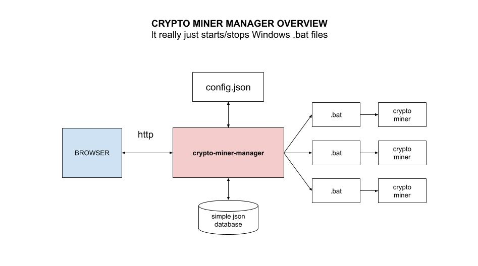

# CRYPTO MINER MANAGER

[](https://github.com/JeffDeCola/crypto-miner-manager/tags)
[](https://pkg.go.dev/github.com/JeffDeCola/crypto-miner-manager)
[](https://goreportcard.com/report/github.com/JeffDeCola/crypto-miner-manager)
[](https://codeclimate.com/github/JeffDeCola/crypto-miner-manager/maintainability)
[](https://codeclimate.com/github/JeffDeCola/crypto-miner-manager/issues)
[](https://hub.docker.com/r/jeffdecola/crypto-miner-manager/)
[](https://jeffdecola.mit-license.org)
[](https://jeffdecola.com)

```text
** THE REPO IS UNDER CONSTRUCTION - CHECK BACK SOON **
```

_Manage all your cryptocurrency miners via a local webpage._

Table of Contents

* [OVERVIEW](https://github.com/JeffDeCola/crypto-miner-manager#overview)
* [PREREQUISITES](https://github.com/JeffDeCola/crypto-miner-manager#prerequisites)
* [SOFTWARE STACK](https://github.com/JeffDeCola/crypto-miner-manager#software-stack)
* [RUN](https://github.com/JeffDeCola/crypto-miner-manager#run)
* [CREATE BINARY](https://github.com/JeffDeCola/crypto-miner-manager#create-binary)
* [STEP 1 - TEST](https://github.com/JeffDeCola/crypto-miner-manager#step-1---test)
* [STEP 2 - BUILD (DOCKER IMAGE VIA DOCKERFILE)](https://github.com/JeffDeCola/crypto-miner-manager#step-2---build-docker-image-via-dockerfile)
* [STEP 3 - PUSH (TO DOCKERHUB)](https://github.com/JeffDeCola/crypto-miner-manager#step-3---push-to-dockerhub)
* [STEP 4 - DEPLOY (TO DOCKER)](https://github.com/JeffDeCola/crypto-miner-manager#step-4---deploy-to-docker)
* [CONTINUOUS INTEGRATION & DEPLOYMENT](https://github.com/JeffDeCola/crypto-miner-manager#continuous-integration--deployment)

Documentation and Reference

* The
  [crypto-miner-manager](https://hub.docker.com/r/jeffdecola/crypto-miner-manager)
  docker image on DockerHub
* [crypto-wallet-status](https://github.com/JeffDeCola/crypto-wallet-status)
* This repos
  [github webpage](https://jeffdecola.github.io/crypto-miner-manager/)
  _built with
  [concourse](https://github.com/JeffDeCola/crypto-miner-manager/blob/master/ci-README.md)_

## OVERVIEW

Here is an overview of what we're going to do,



## PREREQUISITES

You will need the following go packages,

```bash
go get -u -v github.com/sirupsen/logrus
go get -u -v github.com/cweill/gotests/...
```

## SOFTWARE STACK

* DEVELOPMENT
  * [go](https://github.com/JeffDeCola/my-cheat-sheets/tree/master/software/development/languages/go-cheat-sheet)
  * gotests
* OPERATIONS
  * [concourse/fly](https://github.com/JeffDeCola/my-cheat-sheets/tree/master/software/operations/continuous-integration-continuous-deployment/concourse-cheat-sheet)
    (optional)
  * [docker](https://github.com/JeffDeCola/my-cheat-sheets/tree/master/software/operations/orchestration/builds-deployment-containers/docker-cheat-sheet)
* SERVICES
  * [dockerhub](https://hub.docker.com/)
  * [github](https://github.com/)

Where,

* **GUI**
  _golang net/http package and ReactJS_
* **Routing & REST API framework**
  _golang gorilla/mux package_
* **Backend**
  _golang_
* **Database**
  _N/A_

## RUN

To
[run.sh](https://github.com/JeffDeCola/crypto-miner-manager/blob/master/crypto-miner-manager-code/run.sh),

```bash
cd crypto-miner-manager-code
go run main.go
```

As a placeholder, every 2 seconds it will print,

```txt
    INFO[0000] Let's Start this!
    Hello everyone, count is: 1
    Hello everyone, count is: 2
    Hello everyone, count is: 3
    etc...
```

## CREATE BINARY

To
[create-binary.sh](https://github.com/JeffDeCola/crypto-miner-manager/blob/master/crypto-miner-manager-code/bin/create-binary.sh),

```bash
cd crypto-miner-manager-code/bin
go build -o crypto-miner-manager ../main.go
./crypto-miner-manager
```

This binary will not be used during a docker build
since it creates it's own.

## STEP 1 - TEST

To create unit `_test` files,

```bash
cd crypto-miner-manager-code
gotests -w -all main.go
```

To run
[unit-tests.sh](https://github.com/JeffDeCola/crypto-miner-manager/tree/master/crypto-miner-manager-code/test/unit-tests.sh),

```bash
go test -cover ./... | tee test/test_coverage.txt
cat test/test_coverage.txt
```

## STEP 2 - BUILD (DOCKER IMAGE VIA DOCKERFILE)

To
[build.sh](https://github.com/JeffDeCola/crypto-miner-manager/blob/master/crypto-miner-manager-code/build/build.sh)
with a
[Dockerfile](https://github.com/JeffDeCola/crypto-miner-manager/blob/master/crypto-miner-manager-code/build/Dockerfile),

```bash
cd crypto-miner-manager-code
docker build -f build/Dockerfile -t jeffdecola/crypto-miner-manager .
```

You can check and test this docker image,

```bash
docker images jeffdecola/crypto-miner-manager:latest
docker run --name crypto-miner-manager -dit jeffdecola/crypto-miner-manager
docker exec -i -t crypto-miner-manager /bin/bash
docker logs crypto-miner-manager
docker rm -f crypto-miner-manager
```

In **stage 1**, rather than copy a binary into a docker image (because
that can cause issues), the Dockerfile will build the binary in the
docker image,

```bash
FROM golang:alpine AS builder
RUN go get -d -v
RUN go build -o /go/bin/crypto-miner-manager main.go
```

In **stage 2**, the Dockerfile will copy the binary created in
stage 1 and place into a smaller docker base image based
on `alpine`, which is around 13MB.

## STEP 3 - PUSH (TO DOCKERHUB)

You must be logged in to DockerHub,

```bash
docker login
```

To
[push.sh](https://github.com/JeffDeCola/crypto-miner-manager/blob/master/crypto-miner-manager-code/push/push.sh),

```bash
docker push jeffdecola/crypto-miner-manager
```

Check the
[crypto-miner-manager docker image](https://hub.docker.com/r/jeffdecola/crypto-miner-manager)
at DockerHub.

## STEP 4 - DEPLOY (TO DOCKER)

To
[deploy.sh](https://github.com/JeffDeCola/crypto-miner-manager/blob/master/crypto-miner-manager-code/deploy/deploy.sh),

```bash
cd crypto-miner-manager-code
docker run --name crypto-miner-manager -dit jeffdecola/crypto-miner-manager
docker exec -i -t crypto-miner-manager /bin/bash
docker logs crypto-miner-manager
docker rm -f crypto-miner-manager
```

## CONTINUOUS INTEGRATION & DEPLOYMENT

Refer to
[ci-README.md](https://github.com/JeffDeCola/crypto-miner-manager/blob/master/ci-README.md)
on how I automated the above steps.
